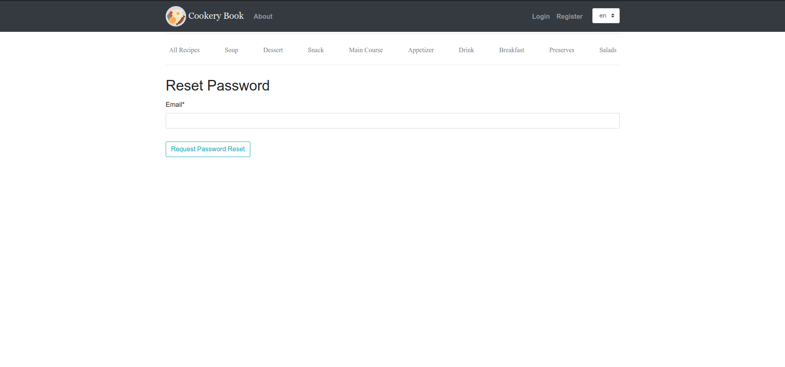
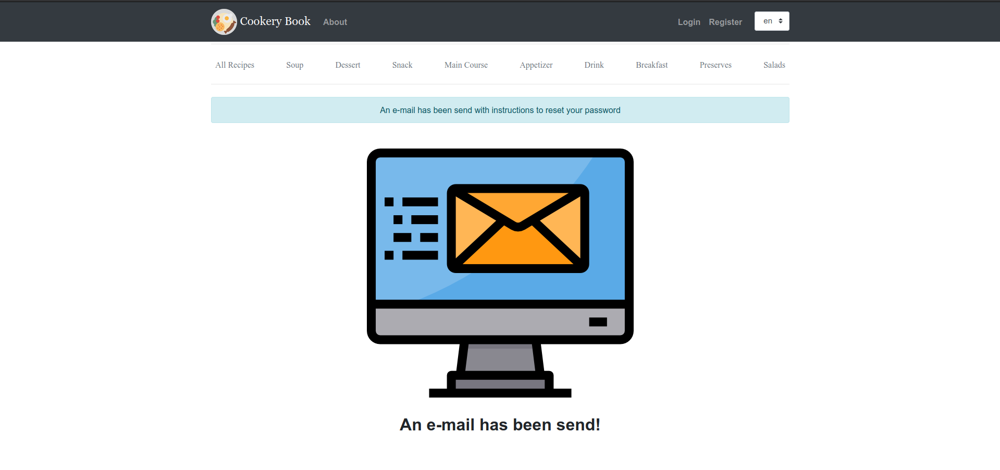
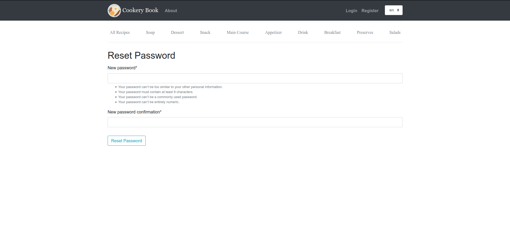
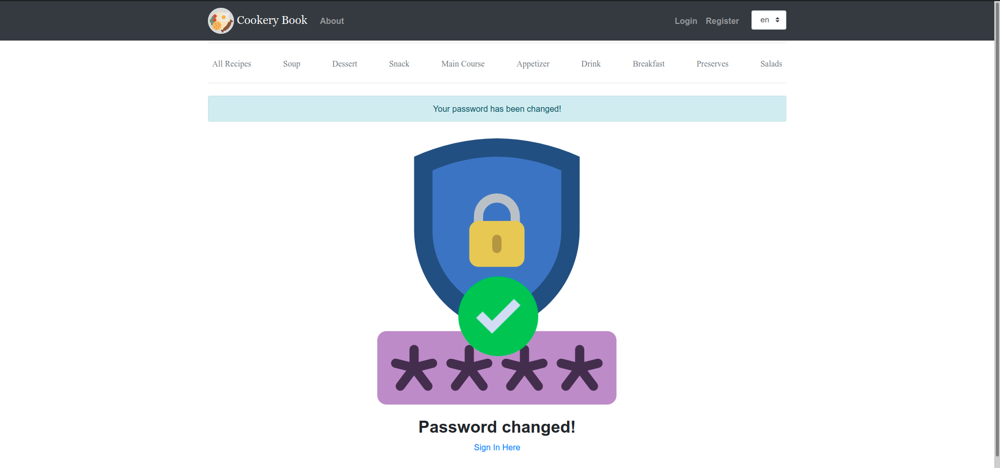

# Cookery Book

---

### Install steps:

*  ```python -m venv venv```
* ```source venv/bin/activate```
* ```pip install -r requirements.txt```
* ``` cd cookery_book```
* ```python manage.py migrate```
* ```python manage.py runserver```

---
### About project:
Site with user authentication. There is 2 available languages: English and Polish. Users can create an account, confirm it by activattion link on e-mail which was passed during registration. They can chose their profile's image. In case forgotting password they can ask for restarting password link. Then they can log in application and browse exisiting recipes added by other users, edit their data e.g. profile's picture, add your own recipes. (In plan there are functionalities: recipes' star rating or likes, comments and downloading pdf with recipe)

---
<br>

### Example screenshots from app

##### Login Page:


---

##### Register Page:


---

##### Request Password Reset:



---

##### Request Password Reset E-mail Send:



---

##### Setting New Password:



---

##### Password Changed Successfully:

